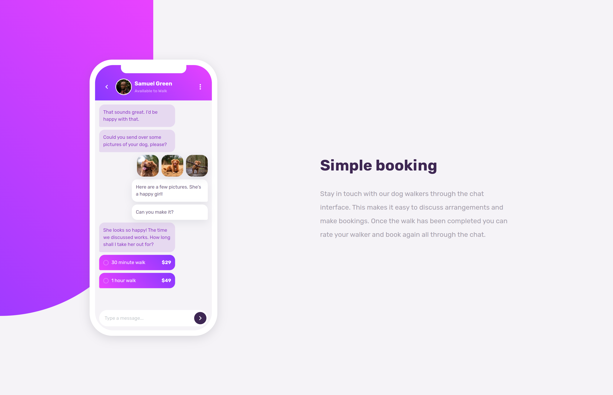

# Frontend Mentor - Chat app CSS illustration solution

This is a solution to the [Chat app CSS illustration challenge on Frontend Mentor](https://www.frontendmentor.io/challenges/chat-app-css-illustration-O5auMkFqY). Frontend Mentor challenges help you improve your coding skills by building realistic projects.

## Table of contents

-   [Overview](#overview)
    -   [The challenge](#the-challenge)
    -   [Screenshot](#screenshot)
    -   [Links](#links)
-   [My process](#my-process)
    -   [Built with](#built-with)
    -   [What I learned](#what-i-learned)
    -   [Continued development](#continued-development)
    -   [Useful resources](#useful-resources)
-   [Author](#author)

## Overview

### The challenge

Users should be able to:

-   View the optimal layout for the component depending on their device's screen size
-   **Bonus**: See the chat interface animate on the initial load

### Screenshot



### Links

-   Solution URL: [https://github.com/alvaro-jrr/chat-app-css-illustration](https://github.com/alvaro-jrr/chat-app-css-illustration)
-   Live Site URL: [Add live site URL here](https://your-live-site-url.com)

## My process

### Built with

-   Semantic HTML5 markup
-   CSS custom properties
-   Flexbox
-   CSS Grid
-   Mobile-first workflow

### What I learned

I'm proud of being able to create the phone and inside of it the chat app, I used the transform property to scale the phone size according the device screen size. Below the HTML and CSS I made to create the phone:

```html
<section class="phone">
	<div class="phone__notch"></div>

	<div class="phone__screen">
		<!-- chat app -->
	</div>
</section>
```

```css
:root {
	--phone-radius: 50pt;
	--phone-screen-radius: calc(var(--phone-radius) - 10pt);
}

.phone {
	transform: scale(0.7);
	position: relative;
	display: grid;
	place-items: center;
	background: var(--white);
	border-radius: var(--phone-radius);
	padding: 1rem;
	height: 50.75rem;
	width: 23.4375rem;
	box-shadow: rgba(100, 100, 111, 0.2) 0px 7px 29px 0px;
	margin: 0 auto;
}

.phone__notch {
	position: absolute;
	top: 1rem;
	border-bottom-left-radius: 1rem;
	border-bottom-right-radius: 1rem;
	height: 1.5rem;
	width: 12rem;
	background: var(--white);
}

.phone__screen {
	background: var(--white);
	border-radius: var(--phone-screen-radius);
	height: 100%;
	width: 100%;
}

@media (min-width: 1024px) {
	.phone {
		align-self: center;
		transform: scale(0.8);
	}
}
```

### Continued development

I want to keep improving in CSS class naming and use of the page's white space.

### Useful resources

-   [Josh's Custom CSS Reset ](https://www.joshwcomeau.com/css/custom-css-reset/) - This helped me reset my CSS and gave me more knowledge due the way it works.

## Author

-   Github - [Alvaro Resplandor](https://github.com/alvaro-jrr)
-   Frontend Mentor - [@alvaro-jrr](https://www.frontendmentor.io/profile/alvaro-jrr)
